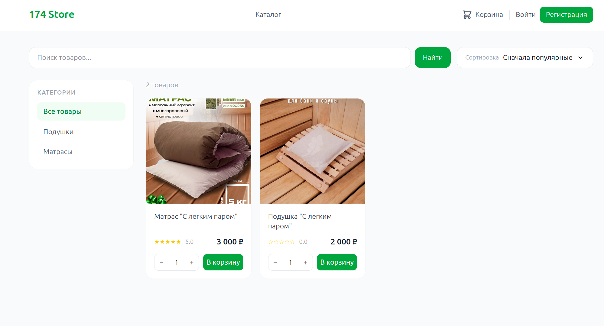

# 174-Store

[](https://fastapi.tiangolo.com/)
[](https://www.sqlalchemy.org/)
[](https://www.postgresql.org/)
[](https://www.python.org/)
[](https://react.dev/)
[](https://www.docker.com/)
[](https://opensource.org/licenses/MIT)
[](https://174-store.ru)

Полностековый интернет-магазин: FastAPI-бэкенд + React SPA-фронтенд. Поддерживает роли, корзину, заказы и интеграцию с платёжной системой YooKassa.



---

## Возможности

### Бэкенд
- **Аутентификация** — JWT access (30 мин) + refresh (7 дней) токены
- **Роли пользователей** — `buyer`, `seller`, `admin` с разграниченными правами
- **Каталог товаров** — полнотекстовый поиск (PostgreSQL, русский язык), фильтрация по цене, категории, наличию, продавцу; пагинация
- **Иерархические категории** — древовидная структура с `parent_id`
- **Загрузка изображений** — jpg, png, webp до 2 МБ, хранятся с UUID-именами
- **Система отзывов** — оценки 1–5, один отзыв на товар, автоматический пересчёт рейтинга
- **Вложенные ответы на отзывы** — древовидная структура (`reply.parent_id`)
- **Корзина** — с проверкой остатков и уникальностью позиций
- **Заказы** — оформление из корзины, защита от race condition через `SELECT FOR UPDATE`
- **Платежи** — интеграция с YooKassa, идемпотентный webhook
- **Мягкое удаление** — через флаг `is_active` для товаров, отзывов, ответов, категорий
- **CORS** — настраивается через переменные окружения
- **Логирование** — loguru с контекстным `log_id` на каждый запрос

### Фронтенд
- **SPA на React** — клиентская маршрутизация через React Router
- **Страницы**: каталог, карточка товара, корзина, оформление заказа, история заказов, профиль, вход/регистрация, панель администратора
- **Фильтрация и поиск** — по тексту, категории, цене, наличию на каталоге товаров
- **Отзывы и ответы** — создание, редактирование, удаление (своих); ответ на ответ; бейдж «Продавец» у admin-пользователей
- **Корзина** — с бейджем количества в навбаре
- **Оформление заказа** — форма с данными доставки перед переходом к оплате
- **Профиль** — отображаемое имя, email, номер профиля
- **Стилизованные модальные окна** — вместо браузерных `confirm()`

---

## Технологический стек

| Категория | Технология |
|---|---|
| Framework | FastAPI 0.136.0 |
| ORM | SQLAlchemy 2.0.49 (async) |
| База данных | PostgreSQL 16 + asyncpg 0.31.0 |
| Миграции | Alembic 1.18.4 |
| Аутентификация | PyJWT 2.12.1 + bcrypt 4.0.1 |
| Валидация | Pydantic 2.13.3 |
| Платежи | YooKassa 3.10.1 |
| Сервер (dev) | Uvicorn 0.45.0 |
| Сервер (prod) | Gunicorn + UvicornWorker |
| Reverse Proxy | Nginx 1.25 |
| Контейнеризация | Docker + Docker Compose |
| Логирование | Loguru 0.7.3 |
| UI Framework | React 19 + React Router 7 |
| Сборка фронтенда | Vite 8 |
| Стили | Tailwind CSS v4 |
| HTTP-клиент | Axios |

---

## Быстрый старт (локально)

### Требования

- Docker и Docker Compose
- Node.js 20+ (для фронтенда)

### Бэкенд

```bash
git clone https://github.com/d33sty/174-store.git
cd 174-store
cp .env.example .env
# Заполнить .env своими значениями
docker compose up -d --build
docker compose exec web alembic upgrade head
```

API доступен на `http://localhost:8000`.  
Документация: `http://localhost:8000/docs` (Swagger UI), `http://localhost:8000/redoc` (ReDoc).

### Фронтенд

```bash
cd frontend
npm install
npm run dev
```

Фронтенд доступен на `http://localhost:5173`. Запросы к `/api` проксируются на `http://localhost:8000` через встроенный Vite proxy.

---

## Продакшн-деплой

```bash
cp .env.example .env
# Заполнить .env продакшн-значениями
docker compose -f docker-compose.prod.yml up -d --build
docker compose -f docker-compose.prod.yml exec web alembic upgrade head
```

В продакшн-конфиге:
- Nginx собирается через **многоэтапный Docker-образ**: на первом этапе Node.js собирает React (`npm run build`), на втором — итоговый образ Nginx берёт `dist/` и конфиг
- Gunicorn запускает 4 воркера с UvicornWorker
- Nginx слушает порты 80 и 443 (HTTPS через Let's Encrypt / Certbot)
- HTTP → HTTPS редирект на уровне Nginx
- Nginx раздаёт React SPA по `/`, API проксирует по `/api/` (срезая префикс), медиафайлы раздаёт напрямую по `/api/media/` из Docker volume
- Порт 8000 не открыт наружу — только через Nginx

### Пересборка после обновления кода

```bash
git pull
docker compose -f docker-compose.prod.yml down
docker compose -f docker-compose.prod.yml build --no-cache
docker compose -f docker-compose.prod.yml up -d
docker compose -f docker-compose.prod.yml exec web alembic upgrade head
```

---

## Переменные окружения

Скопировать `.env.example` в `.env` и заполнить:

```env
# JWT
SECRET_KEY=         # 64-символьный hex-ключ

# База данных
DB_USER=            # пользователь PostgreSQL
DB_PASS=            # пароль
DB_HOST=            # хост (в Docker: db)
DB_PORT=5432
DB_NAME=            # имя базы

# YooKassa
YOOKASSA_SHOP_ID=           # ID магазина
YOOKASSA_SECRET_KEY=        # секретный ключ (live_ или test_)
YOOKASSA_RETURN_URL=        # URL возврата после оплаты

# CORS (домены через запятую)
CORS_ORIGINS=http://example.com,https://example.com
```

---

## Роли и права доступа

| Роль | Права |
|---|---|
| **buyer** (по умолчанию) | Просмотр каталога, управление корзиной, оформление заказов, написание отзывов и ответов |
| **seller** | Всё что buyer + создание, редактирование и удаление своих товаров |
| **admin** | Полный доступ: управление категориями и товарами, удаление любых отзывов и ответов |

Роль `admin` назначается вручную через базу данных.

---

## API Эндпоинты

### Пользователи `/users`

| Метод | Путь | Доступ | Описание |
|---|---|---|---|
| POST | `/users/` | Все | Регистрация |
| GET | `/users/me` | Авторизован | Данные текущего пользователя |
| PUT | `/users/me` | Авторизован | Обновить профиль (email, пароль, display_name) |
| POST | `/users/token` | Все | Вход, получение access + refresh токенов |
| POST | `/users/refresh-token` | Все | Обновление refresh-токена |
| POST | `/users/refresh-access` | Все | Получение нового access-токена |

### Категории `/categories`

| Метод | Путь | Доступ | Описание |
|---|---|---|---|
| GET | `/categories/` | Все | Список активных категорий |
| POST | `/categories/` | Admin | Создать категорию |
| PUT | `/categories/{id}` | Admin | Обновить категорию |
| DELETE | `/categories/{id}` | Admin | Мягкое удаление категории |

### Товары `/products`

| Метод | Путь | Доступ | Описание |
|---|---|---|---|
| GET | `/products/` | Все | Список товаров с фильтрацией и пагинацией |
| POST | `/products/` | Seller | Создать товар (с изображением) |
| GET | `/products/category/{id}` | Все | Товары по категории |
| GET | `/products/{id}` | Все | Детальная информация о товаре |
| PUT | `/products/{id}` | Seller (свой) | Обновить товар |
| DELETE | `/products/{id}` | Seller (свой) | Мягкое удаление товара |
| GET | `/products/{id}/reviews/` | Все | Отзывы на товар |

**Параметры фильтрации `GET /products/`:**

| Параметр | Тип | Описание |
|---|---|---|
| `page` | int | Номер страницы (default: 1) |
| `page_size` | int | Размер страницы (default: 20, max: 100) |
| `category_id` | int | Фильтр по категории |
| `search` | str | Полнотекстовый поиск (русский язык) |
| `min_price` | float | Минимальная цена |
| `max_price` | float | Максимальная цена |
| `in_stock` | bool | Только товары в наличии |
| `seller_id` | int | Фильтр по продавцу |

### Отзывы `/reviews`

| Метод | Путь | Доступ | Описание |
|---|---|---|---|
| GET | `/reviews/` | Все | Список всех отзывов |
| POST | `/reviews/` | Авторизован | Создать отзыв (один на товар) |
| PUT | `/reviews/{id}` | Автор | Обновить отзыв |
| DELETE | `/reviews/{id}` | Автор / Admin | Мягкое удаление отзыва |
| GET | `/reviews/{id}/replies` | Все | Ответы под отзывом |

### Ответы на отзывы `/replies`

| Метод | Путь | Доступ | Описание |
|---|---|---|---|
| GET | `/replies/` | Все | Список всех ответов |
| POST | `/replies/` | Авторизован | Создать ответ (поддерживается `parent_id`) |
| PUT | `/replies/{id}/` | Автор | Обновить ответ |
| DELETE | `/replies/{id}/` | Автор / Admin | Мягкое удаление ответа |

### Корзина `/cart`

| Метод | Путь | Доступ | Описание |
|---|---|---|---|
| GET | `/cart/` | Авторизован | Содержимое корзины |
| POST | `/cart/items` | Авторизован | Добавить товар |
| PUT | `/cart/items/{product_id}` | Авторизован | Изменить количество |
| DELETE | `/cart/items/{product_id}` | Авторизован | Удалить позицию |
| DELETE | `/cart/` | Авторизован | Очистить корзину |

### Заказы `/orders`

| Метод | Путь | Доступ | Описание |
|---|---|---|---|
| POST | `/orders/checkout` | Авторизован | Оформить заказ из корзины и создать платёж YooKassa |
| GET | `/orders/` | Авторизован | Список своих заказов (пагинация) |
| GET | `/orders/{id}` | Авторизован (свой) | Детали заказа |
| GET | `/orders/{id}/status` | Авторизован (свой) | Статус оплаты заказа |

### Платежи `/payments`

| Метод | Путь | Доступ | Описание |
|---|---|---|---|
| POST | `/payments/yookassa/webhook` | YooKassa | Webhook обновления статуса платежа |

---

## Структура проекта

```
174-store/
├── app/
│   ├── main.py              # Точка входа, middleware, подключение роутеров
│   ├── config.py            # Переменные окружения
│   ├── database.py          # Async подключение к PostgreSQL
│   ├── auth.py              # JWT, хеширование, role guards
│   ├── db_depends.py        # DI для сессий БД
│   ├── schemas.py           # Pydantic схемы запросов и ответов
│   ├── payments.py          # Async обёртка над YooKassa SDK
│   ├── models/
│   │   ├── users.py
│   │   ├── categories.py
│   │   ├── products.py      # GIN-индекс для полнотекстового поиска
│   │   ├── reviews.py
│   │   ├── replies.py
│   │   ├── cart_items.py
│   │   └── orders.py
│   ├── routers/
│   │   ├── users.py
│   │   ├── categories.py
│   │   ├── products.py
│   │   ├── reviews.py
│   │   ├── replies.py
│   │   ├── cart.py
│   │   ├── orders.py
│   │   └── payments.py
│   ├── migrations/          # Alembic миграции
│   ├── Dockerfile           # Dev образ
│   └── Dockerfile.prod      # Prod образ
├── frontend/
│   ├── src/
│   │   ├── api/             # Axios клиент и запросы
│   │   ├── components/      # Переиспользуемые компоненты (Navbar и др.)
│   │   ├── context/         # AuthContext, CartContext
│   │   ├── pages/           # CatalogPage, ProductPage, CartPage, CheckoutPage,
│   │   │                    # OrdersPage, OrderDetailPage, ProfilePage,
│   │   │                    # LoginPage, RegisterPage, AdminPage
│   │   └── App.jsx
│   ├── vite.config.js       # Dev proxy: /api → localhost:8000
│   └── package.json
├── nginx/
│   ├── Dockerfile           # Многоэтапный образ: Node.js build → Nginx
│   └── 174-store.conf       # SPA + API proxy + media + HTTPS
├── media/                   # Загруженные изображения (dev)
├── docker-compose.yml       # Dev окружение (бэкенд + БД)
├── docker-compose.prod.yml  # Prod окружение (Gunicorn + Nginx + Certbot)
├── .env.example
└── alembic.ini
```
